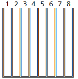
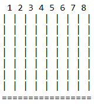

# Connect Four
Stage 2 of 5 for JetBrains Academy - Kotlin - [Connect Four project](https://hyperskill.org/projects/202/stages/1003/implement).   
This stage has us add the printing of the game board.
## Requirements
### Description
In this stage, you need to draw the game board by using the `║, ╚, ═, ╩, ╝` box-drawing characters. You can find more information about these characters in the corresponding [Wikipedia article](https://en.wikipedia.org/wiki/Box-drawing_character), but you can also simply copy them.

Construct a board in the manner shown in the following example for a 7x8 board:    
    
Print the column number above each respective column and use the above-mentioned box-drawing characters for creating the board lines. You can find more board types in the Examples section.

There is the possibility, due to a known issue, that the `║, ╚, ═, ╩, ╝` box-drawing characters can't be correctly printed at the console output. Instead the `?` character is printed for each of them. If this situation arises, then implement the board by using the plain text `|` and `=` plain text characters as following. Either case will be accepted as a valid solution. Also, a plain text board example is available at each stage.    
    
The board size can vary, so your program should adapt to any possible size.
### Objectives
1. Draw and print the board set by users according to the procedure above;
2. Print the column numbers on the board. Mind the spaces between characters.
### Examples
The greater-than symbol followed by a space (`> `) represents the user input. Note that it's not part of the input.
#### Example 1: printing the board
```text
Connect Four
First player's name:
> Sophia
Second player's name:
> John
Set the board dimensions (Rows x Columns)
Press Enter for default (6 x 7)
> 8 x 8
Sophia VS John
8 X 8 board
 1 2 3 4 5 6 7 8
║ ║ ║ ║ ║ ║ ║ ║ ║
║ ║ ║ ║ ║ ║ ║ ║ ║
║ ║ ║ ║ ║ ║ ║ ║ ║
║ ║ ║ ║ ║ ║ ║ ║ ║
║ ║ ║ ║ ║ ║ ║ ║ ║
║ ║ ║ ║ ║ ║ ║ ║ ║
║ ║ ║ ║ ║ ║ ║ ║ ║
║ ║ ║ ║ ║ ║ ║ ║ ║
╚═╩═╩═╩═╩═╩═╩═╩═╝
```
#### Example 2: the default size board
```text
Connect Four
First player's name:
> Sophia
Second player's name:
> John
Set the board dimensions (Rows x Columns)
Press Enter for default (6 x 7)
>
Sophia VS John
6 X 7 board
 1 2 3 4 5 6 7
║ ║ ║ ║ ║ ║ ║ ║
║ ║ ║ ║ ║ ║ ║ ║
║ ║ ║ ║ ║ ║ ║ ║
║ ║ ║ ║ ║ ║ ║ ║
║ ║ ║ ║ ║ ║ ║ ║
║ ║ ║ ║ ║ ║ ║ ║
╚═╩═╩═╩═╩═╩═╩═╝
```
#### Example 3: plain text board
```text
Connect Four
First player's name:
> Sophia
Second player's name:
> John
Set the board dimensions (Rows x Columns)
Press Enter for default (6 x 7)
> 7 x 8
Sophia VS John
7 X 8 board
 1 2 3 4 5 6 7 8
| | | | | | | | |
| | | | | | | | |
| | | | | | | | |
| | | | | | | | |
| | | | | | | | |
| | | | | | | | |
| | | | | | | | |
=================
```